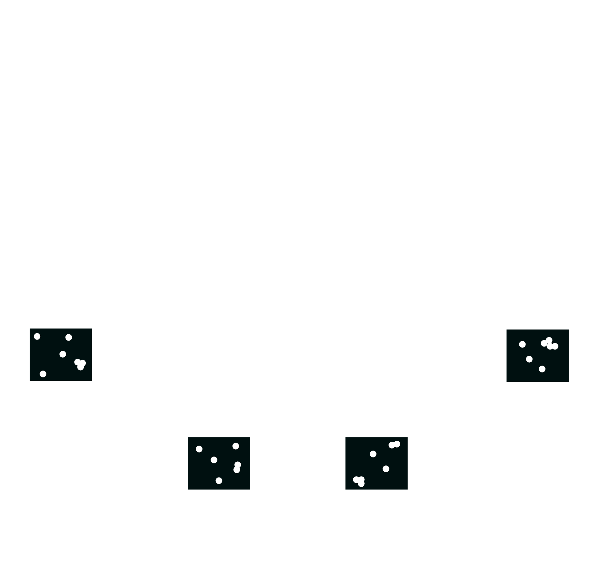

import { Split } from "mdx-deck/layouts";
import { Image } from "mdx-deck";

export { default as theme } from "./theme";

  

    <h1>Artificial Life</h1>
  

<Image
  src="speedmuch.gif"
  style={{
    position: "fixed",
    width: "100vw",
    height: "100vh",
    left: 0,
    top: 0
  }}
/>

---

# Problem

Simulate the development of multi-cellular entities out of single cellular starting components.

---

# System Architecture

export default Split;

---

export default Split;

# Infrastructure

---

export default Split;

# Technologies

---

export default Split;

# Compute Step Lifecycle

---

export default Split;

# Cell Interaction Service

---

# Questions

---

## How can we store a queryable state of our Cell Simulation?

---

## Does anyone know about scientific 3D modeling software?

---

## Experience with the movement of small robots in difficult terrain?

---

## Contacts to professors/staff ETH Zürich/other robotic centers?

---

## Contacts to organizations that provide first aid after natural disasters?
